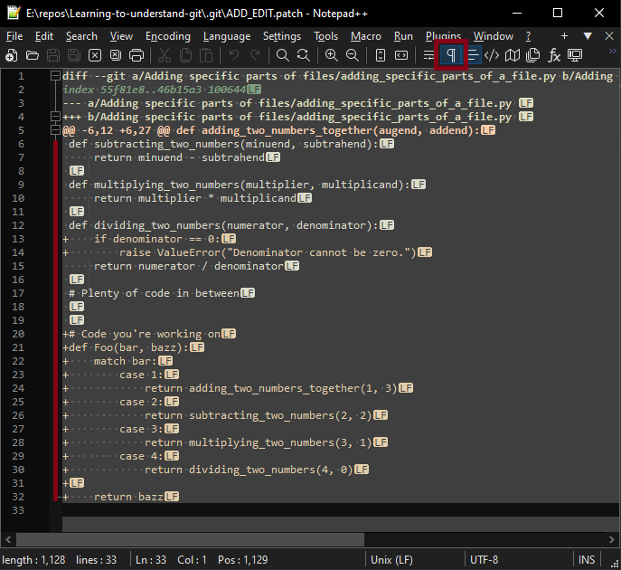

# Adding files is the beginning

As I work with git I find myself adding files `git add filename.txt`. When I have several files to commit `git add .` adds them all. That is all well and good for clean sanitary perfect conditions. I don't usually have that occur.

Often I find myself working on a section of code when I see an issue in another region of code. My past-self would say "Well. Since I'm here I can add this little cleanup." My current-self usually adds a `TODO:` note with enough information to correct it. After doing that I move on. The issue is those edits accumulate. When it comes time to add and commit the changes I intended to make `git add .` adds everything.

From the context of my original intent, the edits I made are unwanted noise. They don't belong to what I worked on. I want atomic self containing commits. No contamination from other edits. ¿What to do? [git add -e](https://git-scm.com/docs/git-add#Documentation/git-add.txt--e) is the tool for the job. `-e` is a synonym/alias for `--edit`. You get to decide what you want to add.

To illustrate this point I start with a contrived math example in python.

```python
# Code Above

def adding_two_numbers_together(augend, addend):
    return augend + addend

def subtracting_two_numbers(minuend, subtrahend):
    return minuend - subtrahend

def multiplying_two_numbers(multiplier, multiplicand):
    return multiplier * multiplicand

def dividing_two_numbers(numerator, denominator):
    return numerator / denominator

# Plenty of code in between


# Code you're working on
def Foo(bar, bazz):
    match bar:
        case 1:
            return adding_two_numbers_together(1, 3)
        case 2:
            return subtracting_two_numbers(2, 2)
        case 3:
            return multiplying_two_numbers(3, 1)
        case 4:
            return dividing_two_numbers(4, 0)

    return bazz
```

Assume only valid numerical data will ever be used. Do you see it? The issue. It comes from division. If you have a zero in the denominator you end up with a `ZeroDivisionError`. Knowing this you edit it to have a proper guard clause.

```python
def dividing_two_numbers(numerator, denominator):
    if denominator == 0:
        raise ValueError("Denominator cannot be zero.")

    return numerator / denominator
```

Better. But now you're faced with the issue of mixing concerns if you execute `git add .`. This is something you *do not want*. When I didn't know how to properly edit/patch I would:
 - manually undo the correction
 - save the file
 - add the main focus changes and commit
 - redo (ctrl+y) to undo the manual removal
 - save the file with the correction
 - `git add ...` the guard cause correction and commit

Clunky. Awkward. So very easy to lose work unintentionally this way. I lost edits by unintentionally typing and destroying the redo stack. My past-self still aches from doing it this way. Don't do it this way. Really. Don't.

## A better way
Review the changes with `git diff`.

```python
ivenbach MINGW64 /e/repos/Learning-to-understand-git/Adding specific parts of files (addingSpecificPartsOfFiles)
$ git diff adding_specific_parts_of_a_file.py
diff --git a/Adding specific parts of files/adding_specific_parts_of_a_file.py b/Adding specific parts of files/adding_specific_parts_of_a_file.py
index 55f81e8..0ecca9a 100644
--- a/Adding specific parts of files/adding_specific_parts_of_a_file.py 
+++ b/Adding specific parts of files/adding_specific_parts_of_a_file.py
@@ -10,8 +10,23 @@ def multiplying_two_numbers(multiplier, multiplicand):
     return multiplier * multiplicand

 def dividing_two_numbers(numerator, denominator):
+    if denominator == 0:
+        raise ValueError("Denominator cannot be zero.")
     return numerator / denominator

 # Plenty of code in between


+# Code you're working on
+def Foo(bar, bazz):
+    match bar:
+        case 1:
+            return adding_two_numbers_together(1, 10)
+        case 2:
+            return subtracting_two_numbers(2, 9)
+        case 3:
+            return multiplying_two_numbers(3, 8)
+        case 4:
+            return dividing_two_numbers(4, 0)
+
+    return bazz
```

The expected changes are there. Execute `git add . -e` to begin the process of adding the changes. In the text editor you now see the same diff shown for editing the patch.
> [Editing Patches](https://git-scm.com/docs/git-add#_editing_patches) states: If you want to abort the operation entirely (i.e., stage nothing new in the index), simply delete all lines of the patch.

Do that right now. Delete everything. Save the file. Close it. The result of an empty patch. No harm. No foul. No problem. No panic.

```git commit
ivenbach MINGW64 /e/repos/Learning-to-understand-git/Adding specific parts of files (addingSpecificPartsOfFiles)
$ git add . -e
fatal: empty patch. aborted
```

Review the working directory with `git status` and `git diff` to reassure yourself if you need.

With that empty patch aborted, now it is time to add in the original changes. Once more execute `git add . -e` to open up the text editor with git. Remove to remove the `+` characters at the beginning of the guard clause. Save the edit and close the text editor.

```git
ivenbach MINGW64 /e/repos/Learning-to-understand-git/Adding specific parts of files (READMEdiffCheck)
$ git add -e adding_specific_parts_of_a_file.py 
error: patch failed: Adding specific parts of files/adding_specific_parts_of_a_file.py:6
error: Adding specific parts of files/adding_specific_parts_of_a_file.py: patch does not apply
fatal: could not apply '.git/ADD_EDIT.patch'
```

Heads Up: The patch fails. ¿Why? Editing the patch prefixes every line with one of 3 characters:
 - ` ` (space): Untouched content
 - `+` (plus): New content
 - `-` (minus): Removing content

The image below shows this. I bring this up as it was very confusing for me when I started editing patches. I would edit the text, save it, and close the text editor to see it was a failed patch. Removing the `+` but leaving the line results in an invalid patch.



Now we'll apply the patch as it relates to the methods and their functionality. As before execute `git add . -e` to choose what to apply. This time remove the lines with the guard clause entirely. Save the text editor and close it.

```python
diff --git a/Adding specific parts of files/adding_specific_parts_of_a_file.py b/Adding specific parts of files/adding_specific_parts_of_a_file.py
index 55f81e8..46b15a3 100644
--- a/Adding specific parts of files/adding_specific_parts_of_a_file.py	
+++ b/Adding specific parts of files/adding_specific_parts_of_a_file.py	
@@ -6,12 +6,27 @@ def adding_two_numbers_together(augend, addend):
 def subtracting_two_numbers(minuend, subtrahend):
     return minuend - subtrahend
 
 def multiplying_two_numbers(multiplier, multiplicand):
     return multiplier * multiplicand
 
 def dividing_two_numbers(numerator, denominator):
     return numerator / denominator
 
 # Plenty of code in between
 
 
+# Code you're working on
+def Foo(bar, bazz):
+    match bar:
+        case 1:
+            return adding_two_numbers_together(1, 3)
+        case 2:
+            return subtracting_two_numbers(2, 2)
+        case 3:
+            return multiplying_two_numbers(3, 1)
+        case 4:
+            return dividing_two_numbers(4, 0)
+
+    return bazz
```

With a successful patch there is no error message indicated.

```git
ivenbach MINGW64 /e/repos/Learning-to-understand-git/Adding specific parts of files (READMEdiffCheck)
$ git add -e adding_specific_parts_of_a_file.py 
ivenbach MINGW64 /e/repos/Learning-to-understand-git/Adding specific parts of files (READMEdiffCheck)
$
```

Review the staged changes with `git status`. The edits that were added are in the staging area. The guard clause lines are still indicating modified but are not yet staged for commit, exactly what we want.

```git commit
$ git status
On branch READMEdiffCheck
Your branch is up to date with 'origin/READMEdiffCheck'.

Changes to be committed:
  (use "git restore --staged <file>..." to unstage)
        modified:   adding_specific_parts_of_a_file.py

Changes not staged for commit:
  (use "git add <file>..." to update what will be committed)
  (use "git restore <file>..." to discard changes in working directory)
        modified:   adding_specific_parts_of_a_file.py
```

Add the staged changes with a commit. `git commit -m "Add mathematical methods"`. Now add the guard clause as its own commit. `git add .` and `git commit -m "Add guard clause for zero denominator"`.

Hopefully at this point you see the benefits of applying patches via edits. Make some edits of your own adding and removing text. Make your own patches and apply them. The worst that happens is you add a portion of code you didn't mean to, `git restore --staged filename.txt` removes it so you can do it again. Remember to not forget the ` ` that is needed for patch edits. A little practice and it comes together pretty easily.
