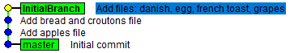
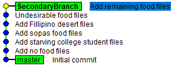
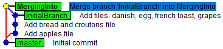
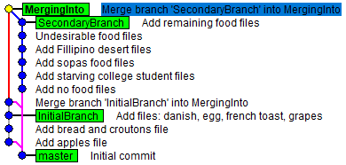

# Branches and why they matter

Start by executing the following commands to create a directory, navigate into the directory, and initialize the repository.

```
mkdir Branching\ example
cd Branching\ example/
git init
```

***Helpful hint:*** If seeing things as they occur helps you then I suggest opening a file explorer to the current directory and have it visible when you execute the commands that follow.

With the repository created we need content to commit. Execute the commands below. They create a text file with the output of the echo command redirected and saved to a text file, [add](https://git-scm.com/docs/git-add) any and all files to staging-area, then [commit](https://git-scm.com/docs/git-commit) all staged files with a commit message. 

```
echo "Text to start" > RandomFileName.txt
git add .
git commit -m "Initial commit"
```

The repository right now has a single commit.\


## Create a development branch and commit to it

The first command [git switch](https://git-scm.com/docs/git-switch) includes the [-c \<new-branch\>](https://git-scm.com/docs/git-switch#Documentation/git-switch.txt--cltnew-branchgt) option to create a new branch with the given name using the currently checked out `master` branch as the starting point. As before files will be created, added, then committed.

```
git switch -c InitialBranch

echo "Apples are tasty" > Apples.txt 
echo "Bread is a staple food for me" > Bread.txt 
echo "Croutons go on salads" > Croutons.txt 
echo "Danishes are deserts" > Danishes.txt 
echo "Eggs come from chickens" > Eggs.txt 
echo "Frech toast combines eggs with bread" > FrenchToast.txt 
echo "Grapes, purple ones especially, always make me think of Grimace" > Grapes.txt 

git add Apples.txt 
git commit -m "Add apples file" 
git add Bread.txt Croutons.txt 
git commit -m "Add bread and croutons file" 
git add . 
git commit -m "Add files: danish, egg, french toast, grapes" 
```

We now have a branch that contains the changes we just made. The graph shows the most recent commits first stepping backwards in history to the first commit.\


Change back to the master branch with `git switch master` to see the only file existing at that commit is RandomFileName.txt. Changing to another branch helps keep you from crossing the streams and maintain separate workflows.

## Creating another development branch and commit some more

Once again we create another branch, create files, and commit them.

```
git switch -c SecondaryBranch

echo "Z has no foods I can think of" > Z.txt
echo "Yogurt has bacteria" > Yogurt.txt
echo "X doesn't have any foods either" > X.txt
echo "Watermellon is a summer time treat" > Watermellon.txt
echo "Vanilla is one of my favorite flavors. True connoiseurs prefer it over chocolate." > Vanilla.txt
echo "Ube is an ingredient in halo-halo, a yummy Fillipino desert" > Ube.txt
echo "Tapioca is something I haven't had since I was a child" > Tapioca.txt
echo "Sugar rots your teeth like reality TV rots your brain" > Sugar.txt
echo "Ranch dressing is inferior to Bleu cheese" > RanchDressing.txt
echo "Quesadillas are a starving college student staple" > Quesadilla.txt
echo "Papaya is a nasty tasting fruit" > Papaya.txt
echo "Oatmeal is another starving college student staple" > Oatmeal.txt
echo "Nutella should be outlawed because it is an abomination" > Nutella.txt
echo "Menudo fills you up and sticks with you" > Menudo.txt
echo "Lemons make menudo taste even better" > Lemon.txt
echo "Kiwi's are the only K food that come to mind" > Kiwi.txt
echo "Jello reminds me of old people in hospitals" > Jello.txt
echo "Ice cream should be eaten sparingly" > IceCream.txt
echo "Halo-halo is a desert I've come to like" > HaloHalo.txt

git add Z.txt X.txt
git commit -m "Add no food files"
git add Oatmeal.txt Quesadilla.txt
git commit -m "Add starving college student files"
git add Menudo.txt Lemon.txt
git commit -m "Add sopas food files"
git add HaloHalo.txt IceCream.txt Ube.txt
git commit -m "Add Fillipino desert files"
git add Nutella.txt Papaya.txt RanchDressing.txt
git commit -m "Undesirable food files"
git add .
git commit -m "Add remaining food files"
```

Based on the above commits the development graph is as shown below.\


Execute `git branch` to list the 3 branches. The currently checked out branch is indicated by with an `*` (asterisk). Switch to each of the branches with `git switch <BranchName>` and review how the files change in the directory.

## Branches keep work separate

After creating the branches above and checking them out it should be more evident that branches help isolate development work flows. Because creating a branch is so easy it helps to create one any time you're working on a new feature.

# Merging branches together

Currently there are two development branches, `InitialBranch` and `SecondaryBranch`, containing the various food files. Because branches are easy to create, make another `git switch -c MergingInto master` in preparation to merging them.

The command to bring branches together is [git merge](https://git-scm.com/docs/git-merge). When performing the merge we'll use the `--no-ff` to prevent a [fast-forward merge](https://git-scm.com/docs/git-merge#_fast_forward_merge) from occurring so the merge displays in the graph.

Execute `git merge InitialBranch --no-ff` which brings all the commits from `InitialBranch` into the branch we just created and have checked out. You can also see this when executing the [git log](https://git-scm.com/docs/git-log) command and including the `--graph` and `--oneline` options: `git log --graph --oneline`.\


Merge the other branch in with `git merge SecondaryBranch --no-ff`. Below you see where each branch is explicitly merged with the merge commit.\


# Finding merged branches

As branches get merged into the primary development branch you can check for these merged branches by including the [--merged](https://git-scm.com/docs/git-branch#Documentation/git-branch.txt---mergedltcommitgt) flag when executing `git merge --merged`. The corresponding flag for branches not merged is [--no-merged](https://git-scm.com/docs/git-branch#Documentation/git-branch.txt---no-mergedltcommitgt).

To help make the point create another branch based on `master`, create a file and commit it.

```
git switch -c TertiaryBranch master`
touch 1234.txt
git add .
git commit -m "Add number file"
```

For each branch check it out and run `git branch --merged` and `git branch --no-merged` to see the branches that and are not merged.

# Deleting branches

Now that we come to the end it's time to merge all the development branches in.

```
git switch master
git merge TertiaryBranch
git merge MergingInto
```

Execute `git branch --no-merged` to confirm there are no unmerged branches, you should see no output. Remove the branches with `git branch -d InitialBranch MergingInto SecondaryBranch TertiaryBranch` to leave only master.