# Learning to understand git

Understanding version control and Git was not easy to learn for me. It took me longer than it should have. Thankfully I was fortunate to have several people willing to help and explain everything to me. The problem was me. I couldn't relate what I was told to anything I already understood. I understood the *words* that were used as part of the explanation but missed the underlying *meaning*. I was pointed towards the documentation (https://git-scm.com/book/en/v2) and started reading. Again I read the words but missed the meaning. I kept at it this time searching out tutorials.

One that really helped was https://learngitbranching.js.org/. The visual component helped. I saw the HEAD move when a commit was made. The breadcrumbing introduction to git helped the idea of it sink in more than anything else. After completing the tutorial I created a throwaway repository (repo) to test and further my understanding. It was at this point that a lot of what I read previously and read started to make sense.

I created a new directory, started Git Bash on that directory, then ran `git init` to [initialize](https://git-scm.com/docs/git-init) or start the repo.\
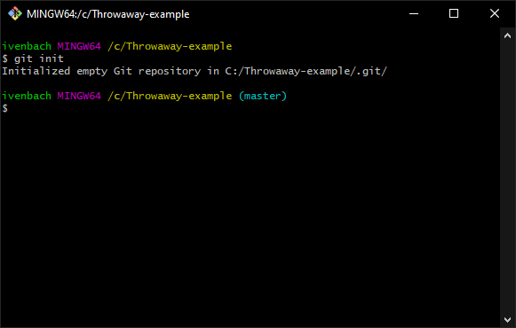

Next I added some text files manually to the directory. I confirmed that these were seen with `git status` to [display the changes made](https://git-scm.com/docs/git-status).\
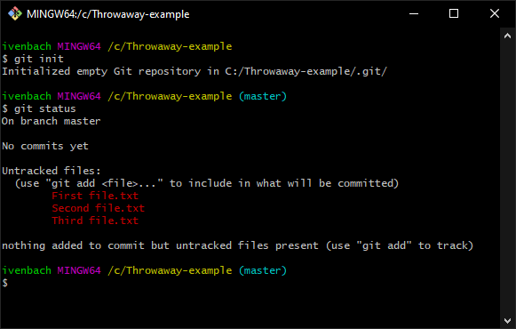

Then as I did previously in the tutorials I [added the files](https://git-scm.com/docs/git-add) via `git add`. The first was added with `git add Fir` and finishing the file name with Tab to result int `git add First\ file.txt`. ***\*\*\*Note:*** The `\` (backslash) is an escape character for the character that follows it, the ` ` &nbsp;(space) character. Files with spaces in their names need the spaces to either be escaped in this manner or otherwise enclosed in quotes `'` (single quote) or `"` (double quote). The following are also valid:
 - `git add 'First file.txt'`
 - `git add "First file.txt"`
 
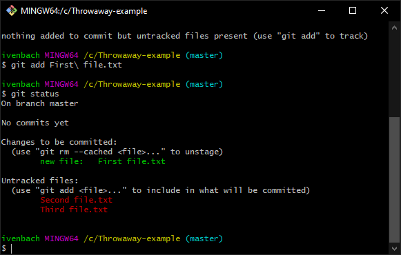

This saves the file, in its current state, to a preparation-area. It is a file of interest but isn't yet a part of the repo. Some synonyms I used below for this area:
 - preparation-area
 - holding-area-just-before-addition
 - staging area  \*\*\***git nomenclature**
 - index        \*\*\***git nomenclature**

The `git add` step gives you control to add only what you want the repo. Now we make further edits to the staging area by adding the other files.

Add the other files executing `git add .` where the `.` (period) indicates you want to add the new files. [Relevant StackOverflow question for adding files](https://stackoverflow.com/questions/572549/difference-between-git-add-a-and-git-add/16162511).\
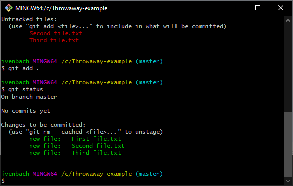

Now that the three files are in the staging area, add them to the repo via [git commit](https://git-scm.com/docs/git-commit). Execute `git commit -m "Initial commit"` where the `-m` is a flag/indicator that the following string `"Initial commit"` is the commit-message/descriptive-reason-it-was-added.\
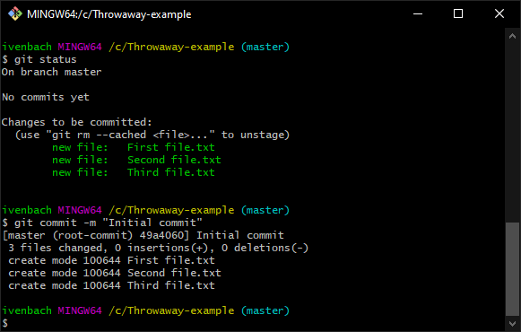

¿Ok now what? Time to see at what ~~brown~~ git can do for you. Delete one of the files. Execute `git status` and you'll see that it has been deleted.\
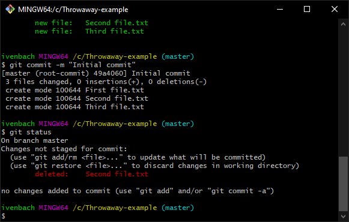

Now it is time to execute [git restore](https://git-scm.com/docs/git-restore). Because the file was committed to the repo you can restore it. Before doing so, navigate to that directory and have it visible. When you execute the command `git restore Second\ file.txt` watch the directory and you'll see that file appear. For me *seeing* the file come back was the [Eureka](https://en.wikipedia.org/wiki/Eureka_(word)) moment I needed.

To test this out I created new files and editted those already existing.
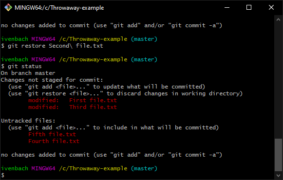

I restored one of the files `git restore First\ file.txt`, and opened it in a text editor confirming the changes weren't there. Executing `git status` confirmed no changes were detected. It was `restore`d back to the same state, an empty file, as when it was added to the repo.

Once again I made edits to First file.txt and saved them. Running `git status` confirmed they were there. ¿What if I want to restore all the files? I executed `git restore .` followed by `git status` to see what changes were left. Naively I was a bit surprised to see files showing.\
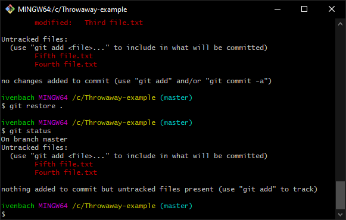

¿Why are those files there? They shouldn't be there... Wait. Maybe they should be. :click: that's when another git puzzle piece connected; I understood the different areas of git. "Working Directory" is just that, the directory-where-work-is-done. Mentally changing the text on the middle arrow to "Stage changes=`git add`" helped.

Another image, git-lifecycle, from the documentation made sense as well.\

When a new file is first seen it is untracked. I checked back up at the previous commands and the new files were indeed "Untracked files". After `git add` the files were in the Staged/Staging-Area, designated as "Changes to be committed".

My question now was ¿how can I remove these files? I already knew I could delete them normally by right clicking and choosing delete, but this small taste of Command Line Interface (CLI) power had me hooked. I wanted more. I eventually found the command I wanted was [git clean](https://git-scm.com/docs/git-clean).

Since I wanted to remove both the remaining untracked files I executed `git clean .`, but as before I watched the directory while I executed the command. Nothing happened. Then I saw the output "fatal: clean.requireForce...".\
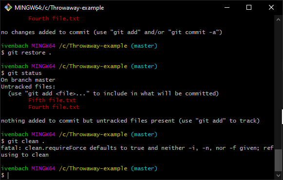

Reading the documentation `-i` was shorthand for `--interactive` "Show what would be done and clean files interactively". Going with that I executed `git clean -i .`
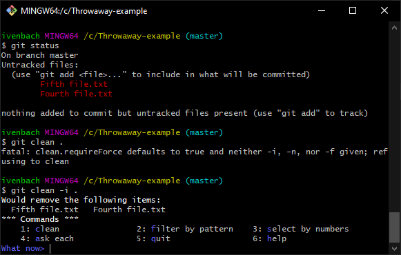

The documentation for [interactive mode](https://git-scm.com/docs/git-clean#_interactive_mode) led me to executing option 1: clean.\
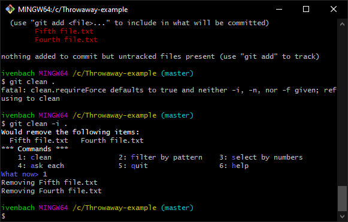

I missed watching the directory to see that they were removed but that didn't matter because I knew I was on my way to learning to understand git.